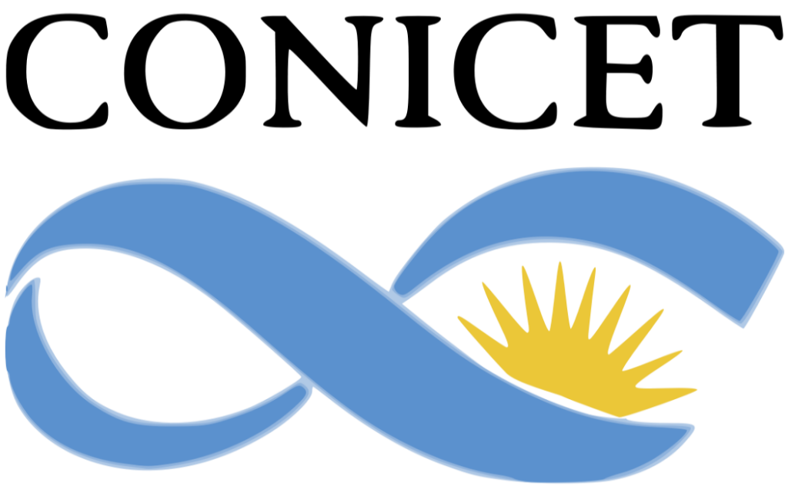

# ASASlightcurve

CONICET-Argentina, Universidad de Mendoza-Argentina, and Universidad Tecnológica Narional Regional Mendoza-Argentina power this development.

   

This work was born from sonoUno desktop, maintains its principles, and uses some of its libraries.

